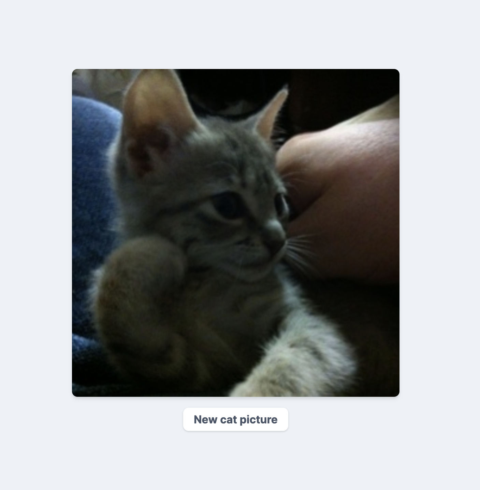

# Vue basics: part 2

**Important**: this workshop assumes you know the very basics of Vue (reactivity, directives like `v-if`, `v-for`, components and computed properties). If you don't please check the first [workshop](https://github.com/thomlom/workshop-vue-basics).

## Explaining a To-Do list

In the last workshop, your task was to build a to-do app that would allow you to add tasks, mark them as completed, edit and delete them. You could also filter them depending on their status and provide some design. Here is the full code:

```html
<html>
  <head>
    <meta charset="UTF-8" />
    <title>To-Do App</title>
    <link
      href="https://cdn.jsdelivr.net/npm/tailwindcss/dist/tailwind.min.css"
      rel="stylesheet"
    />
  </head>

  <body>
    <div id="app" class="container mx-auto p-8 md:w-1/2">
      <h2 class="text-3xl text-grey-darkest uppercase tracking-wide">
        To-Do App
      </h2>
      <input
        v-model="nextTodo"
        class="mt-4 mb-4 p-3 bg-grey-lighter outline-none w-full rounded leading-tight"
        @keyup.enter="addTodo"
        placeholder="Type your task here"
      />
      <ul class="list-reset" v-if="filteredTodos.length">
        <todo-item
          v-for="(todo, i) in filteredTodos"
          :key="`${todo.name}-${i}`"
          :todo="todo"
          :index="i"
          @toggle="toggle"
          @delete="deleteItem"
          @edit="editItem"
        ></todo-item>
      </ul>
      <p v-else class="text-center m-8 text-2xl font-bold text-grey-darker">
        No to-dos!
      </p>
      <ul class="list-reset flex mt-3">
        <li
          v-for="filter in filters"
          @click="currentFilter = filter"
          class="rounded-full uppercase px-2 py-1 text-xs font-bold mr-2 cursor-pointer"
          :class="currentFilter === filter ? 'bg-blue-dark text-white' : 'bg-grey-lighter text-grey-darker'"
        >
          {{ filter }}
        </li>
      </ul>
    </div>
    <script src="https://cdn.jsdelivr.net/npm/vue"></script>
    <script src="main.js"></script>
  </body>
</html>
```

And for the script part:

```js
Vue.component("todo-item", {
  template: `
  	<li class="flex p-4 items-center mt-2 bg-grey-lightest">
      <input type="checkbox" class="-mt-1" @change="$emit('toggle', todo)" :checked="todo.done"/>
      <div class="flex items-center justify-between w-full" >
        <span 
          v-if="!isEditing" 
          @click="isEditing = true" 
          class="ml-4 cursor-pointer" 
          :class="{'line-through text-grey-dark': todo.done}"
        >
        {{ todo.name }}
        </span>
        <input
          v-else
          class="ml-4 mr-2 outline-none p-2 border-grey-light rounded border-2 w-full" 
          type="text" 
          v-model="editedTodo" 
          @keyup.enter="edit"
          @keyup.esc="isEditing = false"
        />
        <svg 
          @click="$emit('delete', index)" 
          class="fill-current h-5 w-5 text-red" 
          role="button" 
          xmlns="http://www.w3.org/2000/svg" 
          viewBox="0 0 20 20"
        >
          <title>Close</title>
          <path d="M14.348 14.849a1.2 1.2 0 0 1-1.697 0L10 11.819l-2.651 3.029a1.2 1.2 0 1 1-1.697-1.697l2.758-3.15-2.759-3.152a1.2 1.2 0 1 1 1.697-1.697L10 8.183l2.651-3.031a1.2 1.2 0 1 1 1.697 1.697l-2.758 3.152 2.758 3.15a1.2 1.2 0 0 1 0 1.698z"/>
        </svg>
      </div>
    </li>
  `,
  props: ["todo", "index"],
  data() {
    return {
      isEditing: false,
      editedTodo: this.todo.name
    };
  },
  methods: {
    edit() {
      this.$emit("edit", this.editedTodo, this.index);
      this.isEditing = false;
    }
  }
});

new Vue({
  el: "#app",
  data: {
    todos: [],
    nextTodo: "",
    filters: ["all", "active", "done"],
    currentFilter: "all"
  },
  mounted() {
    const localTodos = localStorage.getItem("vue-todos");
    if (localTodos) {
      this.todos = JSON.parse(localTodos);
    }
  },
  watch: {
    todos: {
      handler() {
        localStorage.setItem("vue-todos", JSON.stringify(this.todos));
      },
      deep: true
    }
  },
  computed: {
    filteredTodos() {
      switch (this.currentFilter) {
        case "all":
          return this.todos;
        case "active":
          return this.todos.filter(todo => !todo.done);
        case "done":
          return this.todos.filter(todo => todo.done);
        default:
          return this.todos;
      }
    }
  },
  methods: {
    addTodo() {
      if (this.nextTodo) {
        this.todos = [{ name: this.nextTodo, done: false }, ...this.todos];
        this.nextTodo = "";
      }
    },
    toggle(todo) {
      todo.done = !todo.done;
    },
    deleteItem(index) {
      this.todos.splice(index, 1);
    },
    editItem(name, index) {
      this.todos[index].name = name;
    }
  }
});
```

Here are the different steps to build this app:

1. Provide the basic HTML template and render the Vue app inside a root element
2. Decide the model of what's a todo (a `name` and whether it's `done` or not). Provide an array of todos to your `data`.
3. Render an initial list of todos in the template (don't forget to use `key`!)
4. Add an input and bind it to a data property (`nextTodo`) using `v-model`.
5. Create an add button or use a `keyup` event to add the todo in the list of todos.
6. Add the `todo` in the list of todos (in my case, I've added the todo in the first place, so that the newly todo shows up first)
7. Add a checkbox to mark the todo as completed or not.
8. Move the checkbox and the name of a todo inside a new component: `todo-item`. Add the `v-for` directive on the component. Pass the `index` and the `todo` to this component as a prop.
9. Add an event listener to the checkbox and mark it as checked based on the value of `todo.done`. If the checkbox is toggled, send a custom event named `toggle`.
10. Capture the `toggle` event in the main component and toggle the todo.
11. Add an icon to the todo to delete it.
12. Add a `click` event on this icon to emit a `delete` event to the parent component.
13. Capture the `delete` event on the parent component and delete the todo.
14. Add an edit mode to the todo by rendering an input if you click on the todo's name.
15. Send the edited todo to the parent using a custom event named `edit` to edit the todo. You can send this event on clicking on a button. In my case, I've chosen to send this event when the user taps `Enter`.
16. Create an array of three filters in the `data` object: `["all", "active", "done"]`
17. Render the filters in the main component using `v-for`.
18. Add a `currentFilter` property to the data and set the initial value to `all`.
19. Add a `click` event to the filter item that will set the `currentFilter` to the filter that's being clicked.
20. Add a computed property called `filteredTodos` to the main instance and filter the correct todos depending on the value of `currentFilter`.
21. In the `v-for` statement in `todo-item`, replace the `todos` list by the `filteredTodos` computed property.
22. Differentiate the filter by styling the active one.
23. To save the todos in the local storage, add a **deep** watcher on the `todos` array. This watcher will be triggered on every change and will set the todos in the local storage.
24. When the main component is mounted fetch the todos in the local storage and set them in the data.

Some takeaways from this code:

- The design have been done with [Tailwind CSS](https://tailwindcss.com/). It's a utility-first CSS framework so there are a loooot of classes. It may makes the template code bloated but it's very handy when you're used to.
- It's no big deal if you have trouble understanding the full code. The goal here is to globally understand how Vue works and how we can apply what we've learnt on a real app.

## Vue CLI

In this part, we will just look at a very basic project created with Vue CLI. It's an awesome tool because it helps us setting our Vue project that provides support for a lot of popular JS tools such as Webpack, Babel, etc.

As a prerequisite, we will need [Node.js](https://nodejs.org/en/) to be installed on our machines.

**Note** : if you're a macOS user, you can install Node faster using [Homebrew](https://brew.sh/), just run `brew install node`.

1. Run `vue create example`
2. You have two choices: the default (which enables `babel` and `eslint`) or select `Manually select features`. For educational purposes, we will choose `Manually select features`.
3. Select `Babel, Linter/Formatter`
4. Select `ESLint with error prevention only`
5. Select `Lint on save`
6. Select `In dedicated config files` for Babel, PostCSS, ESLint, etc.
7. Answer yes or no, depends on if you like this preset!
8. Vue CLI will do the setup now. You should see a progress bar that is gradually filling...
9. You see `🎉 Successfully created project example`.
10. Follow the instructions provided by Vue CLI (`cd example && npm run serve`)
11. Open your browser and visit `http://localhost:8080/`

Congratulations! You have built your first Vue app using Vue CLI.

Open your newly created project with your favorite code editor (I recommend [VS Code](https://code.visualstudio.com/)).

## Explaining the different files

Do you feel overwhelmed by the number of files? Don't worry. I'm going to give you a quick overview of the files Vue CLI generated.

`public` folder :

- `favicon.ico`: do you see the little icon on the left on your current tab? That's called a favicon. It's an icon that represents your app or your website.
- `index.html`: this is your main html file. It will contain all your Vue code. You can see at the bottom of the file this line: `<div id="app"></div>`. That's important since it's where **Vue will mount your app.**

`src` folder :

- `assets` folder: this is where you will put your assets, that is to say your images, your icons, etc.
- `components` folder: well, this is self-explanatory here. This folder will contain all your **Vue components.**
- `App.vue`: this is the main component that will be mounted to the DOM.
- `main.js`: this is your app **entry point**. This file is responsible for mounting your `App` component into the DOM, specifically in the `#app` div. That's why it was important.

`.browserslistrc`: This project includes what we call Autoprefixer. Simply put, Autoprefixer is a tool that allows us to **add [vendor prefixes](https://www.lifewire.com/css-vendor-prefixes-3466867) in front of certain CSS rule**s (you know `-webkit-transition`, etc) to make sure our CSS code is compliant with most browsers. Well this `.browserslistrc` file allows us to define which browsers we want to target to **generate the optimal output files**. In this example you can see for example that we don't want to target IE 8 to avoid adding a lot of prefixes.

`.eslintrc.js`: it configures which linting/formatting style guide we will follow. Linting and formatting is great to use in any projects as it allows to have a **common style guide with other developers.**

`.gitignore`: your project already includes Git if you cloned the repository. To make sure you don't put any sensitive files, build folders, or anything like this onto GitHub (or GitLab, BitBucket, etc), you just need to put in this file what you don't want to push to your repository.

`babel.config.js`: If you never heard of [Babel](https://babeljs.io/) before, this one might be hard to understand. JavaScript is an evolving language and there are **new features**. But these features are not available for all browsers or old browsers versions. Simply put, Babel enables us to **transpile the new JavaScript code into the old one** so that our code works on most browsers. Therefore, we can use the very last features of JavaScript without worries. Note that `browserslistrc` also works with Babel.

`package.json`: this file contains various **metadata** about your project : name, version but mostly dependencies and scripts. When you ran `yarn install`, yarn fetched the dependencies using your `package.json` file, installed them in the `node_modules` folder and generated `yarn.lock`.

`postcss.config.js`: [PostCSS](https://postcss.org/) transforms your CSS into a **enhanced CSS file**. Here we use autoprefixer that I explained above.

`README.md`: that's what holds the instructions to install the app.

`package-lock.json`: It's a [file](https://docs.npmjs.com/files/package-lock.json) generated by npm that **stores the dependencies version** of the packages you use.

## The commands

As seen before, creating a default project with Vue CLI comes with Babel and ESLint enabled by default. One important thing to note is that Vue CLI projects make use of Webpack: a module bundler. Basically, Webpack analyzes all your modules and JS files, may preprocess them and bundle them into one single minified file. To preprocess files, Webpack uses loaders that transform your source code. For example, Vue has their own loader because of the `.vue` files. We'll see that in a bit.

Your Vue CLI project comes with three `package.json` scripts:

- `serve`: this command starts a dev server that comes with [Hot-Module-Replacement](https://webpack.js.org/concepts/hot-module-replacement/).
- `build`: this command produces a production-ready bundle in the `dist/` directory, with minification for JS/CSS/HTML and auto vendor chunk splitting for better caching. The chunk manifest is inlined into the HTML.
- `lint`: lint your files using ESLint. If ESLint doesn't mean anything to you, it's a tool for identifying and reporting on patterns found in JS code, with the goal of making code more consistent and avoiding bugs. It's considered as a "best practice" to have one in a project and that's why Vue provides it as a default.

If you're curious, there is another command called `inspect` which allows you to inspect the webpack config inside a Vue CLI project. You can run `npx vue-cli-service inspect > config.js` to see what's your config.

## Single File Components

When we played around with Vue.js, we used to define a Vue instance like this:

```js
new Vue({
  el: "#app"
});
```

And components like this:

```js
Vue.component("my-component", {
  // ...
});
```

That worked fine. So why `App.vue` is structured differently?

There are many reasons to that:

- Styling: how would you style your components? Probably by defining a `css` file out of the scope of the component and by importing it in your `html` file.
- Templating: what about these template strings? Don't they look a bit ugly?
- Building: we can't use latest JS features because we can't really add builds steps.

That's why Vue use **single-file components**. They're structured very clearly:

- `template`: Your HTML elements, Vue directives, etc.
- `script`: All that is linked to the Vue instance: `data`, `methods`, etc.
- `style`: Your CSS code.

Here is an example of a `.vue` file:

```html
<template>
  <div>
    Hello world
  </div>
</template>

<script>
  export default {
    name: "my-component"
  };
</script>

<style></style>
```

**Note**: if you're coding with [VS Code](https://code.visualstudio.com/), I recommend that you install the [Vetur](https://marketplace.visualstudio.com/items?itemName=octref.vetur) extension. It's going to make our life easier when building a Vue project (Syntax highlighting, snippets, etc).

Single-file components has many advantages over what we used to do:

- **CSS:** we bring CSS directly into the component. And you know what's even more awesome? You can **restrict the CSS scope to the component only.** No more CSS rules conflicts!
- **Modularity:** the components have their own file and all is scoped into the component only. Therefore, composing components is easier to do.
- **Building:** as we can include build steps to the project, we can use latest JS features, linting, etc.

## Vue DevTools

Because you can build a whole new project with Vue, there are Vue developer tools that you can make use of. This will allow you to explore your project structure (your components) and filter them visualization, inspect your components' data, see the emitted events in real-time, inspect performances, etc. You can install them from here:

- [Firefox addon](https://addons.mozilla.org/en-US/firefox/addon/vue-js-devtools/)
- [Chrome extension](https://chrome.google.com/webstore/detail/vuejs-devtools/nhdogjmejiglipccpnnnanhbledajbpd)

Once you installed it, you should see a "V" icon in your toolbar.

Now, go to [to-do-list](./to-do-list) and run the `serve` script:

```sh
cd 01-to-do-list
npm run serve
```

Go to `localhost:8080`, open your developer tools and search for the `Vue` tab. Go play with this tool and see what changes in your app.

## Building a small project

It's your turn now, your task will be to build something similar as that:



On load, you should see a first cat picture. By clicking on **New cat picture**, you get, well, a new cat picture. You'll need the [Random cat API](https://aws.random.cat/meow) to retrieve cats pictures.

But what's an API, you might think?
